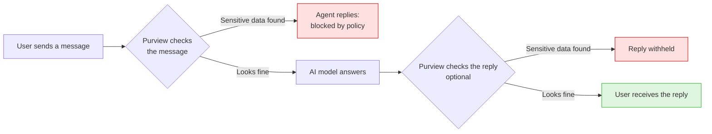
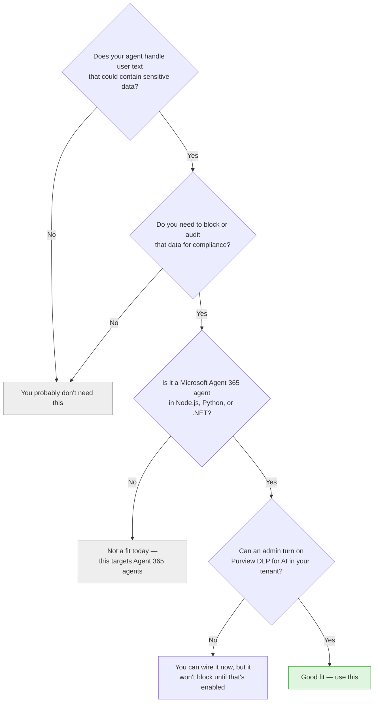
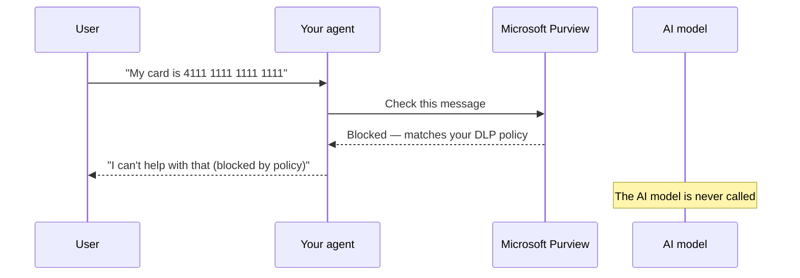
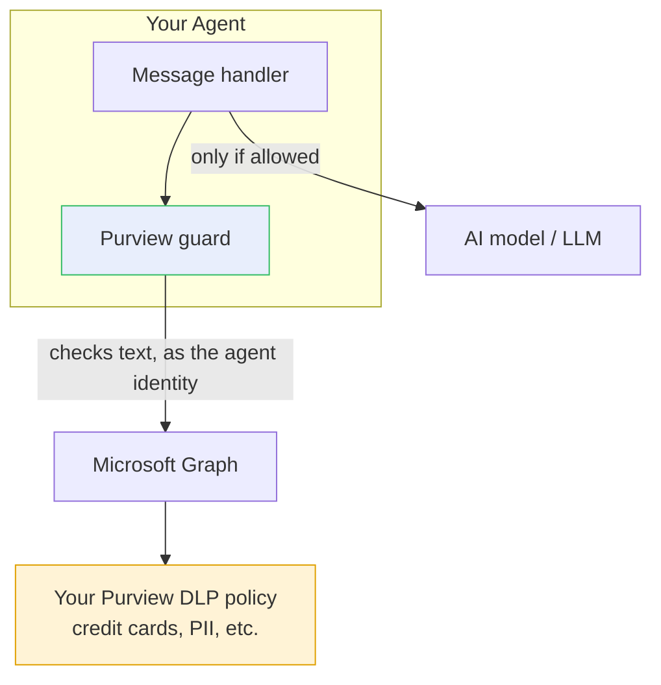

# Microsoft Purview DLP for your Agent 365 agent

**In one sentence:** this adds a safety checkpoint in front of your agent's AI so that
sensitive information (credit card numbers, SSNs, personal data, and anything your
organization's data policies cover) can be **blocked and audited before the AI model ever
sees it**.

It is a small, reversible add-on for an existing **Microsoft Agent 365** agent
(Node.js, Python, or .NET). It does not change what your agent *does* — it just adds a
guard around the AI call.

---

## Why you might want this

AI agents pass whatever a person types straight to a large language model (LLM). If a user
pastes a credit-card number, a customer's personal data, or a confidential document, that
sensitive text is sent to the model — and possibly to logs, analytics, or a third-party
model provider along the way.

If your organization has **data-protection or compliance obligations**, you usually need to:

- **Block** sensitive content from leaving your boundary, and
- **Record** an audit trail of what was checked.

This integration does both, using **Microsoft Purview** — the same data-loss-prevention
(DLP) engine your organization already uses for email and files — now applied to your
agent's conversations.

---

## What it does (the checkpoint)

Every time a user sends your agent a message, the message is checked by Microsoft Purview
**first**. Only if it passes does the AI model get to answer. Optionally, the AI's reply is
checked too before it's sent back.



> **Key point:** when a message is blocked, **the AI model is never called** — the
> sensitive text never leaves your agent. Every checked message is also written to
> Microsoft Purview's audit log, so you get compliance records automatically.

---

## Is this for you?

Use this quick check to decide.



**A good fit if you:**

- Build an Agent 365 agent that people chat with, and
- Must keep sensitive data (PII, financial data, secrets) out of the AI, or need an audit
  trail for compliance/regulatory reasons.

**You probably don't need it if you:**

- Only build internal demos or agents that never touch sensitive data, or
- Already enforce this some other way, or
- Aren't on Microsoft Agent 365.

---

## How it works (a bit more detail)

The check runs **as your agent's own Microsoft 365 identity** (not a shared admin account),
so Purview evaluates it just like it would for a real user. The example below shows a
blocked message.



Under the hood, a small **guard** file sits between your message handler and the AI model,
and asks Microsoft Purview (through Microsoft Graph) whether the text is allowed. Purview
decides based on a **DLP policy** scoped to your agent.



By default it **fails safe**: if Purview can't be reached, the message is blocked rather
than let through. You can change that if you prefer.

---

## What gets added to your agent

The changes are small and easy to undo.

| Change | What it is |
|---|---|
| **1 new file** | The DLP guard — a drop-in file, no editing needed. |
| **A few lines in your message handler** | The two checkpoints (before the AI, and optionally before the reply). |
| **A few settings** | Mainly a single on/off switch: `PURVIEW_DLP_ENABLED`. |
| **1 Microsoft Graph permission** | `Content.Process.User`, added to your agent's existing permissions (nothing broadened). |
| **1 Purview DLP policy** | Created for you, or reuse one you already have, or skip and add it later. |

**Turning it off is easy:** set `PURVIEW_DLP_ENABLED=false` to disable it, or remove the one
file and the few lines to revert completely. Your agent keeps working either way.

---

## What it does **not** do

- It does **not** change your AI's answers — it only allows or blocks a turn.
- It does **not** send your data to any third party — the check goes to **Microsoft
  Purview** through Microsoft Graph.
- It does **not** set up your agent, your Microsoft 365 licensing, or Purview billing — an
  admin does that once (see Requirements).
- It is **not** a network firewall — it inspects the agent's prompt/response *text*.

---

## Requirements

| You need | Why |
|---|---|
| A **Microsoft Agent 365** agent (Node.js, Python, or .NET) | This wires into that agent's message handling. |
| **Microsoft Purview DLP for AI** enabled in your tenant | The blocking/audit engine. This is a paid Purview capability — it needs licensing, pay-as-you-go billing, and "DSPM for AI" onboarding. |
| An **admin** who can create a DLP policy and approve one permission | To define what counts as "sensitive" and to grant `Content.Process.User`. |

> Until Purview DLP for AI is enabled and a matching policy exists, the guard runs but simply
> **allows** everything (and says so in its logs). Nothing breaks — it just doesn't block yet.

---

## Supported agents

| Language | Status |
|---|---|
| **Node.js / TypeScript** | ✅ Supported |
| **Python** | ✅ Supported |
| **.NET (C#)** | ✅ Supported (guard is a best-effort port — verify against your SDK version) |

---

## Example

**Blocked** (a credit card number):

```text
User:  My credit card is 4111 1111 1111 1111
Agent: 🚫 I can't help with that — your request was blocked by your
       organization's data-loss-prevention policy.
```

**Allowed** (an ordinary question) — passes straight through to the AI as normal:

```text
User:  What's the weather policy for our Seattle office?
Agent: (normal AI answer)
```

---

## What's in this folder

| Item | For you if you want to… |
|---|---|
| `SKILL.md` | Have the assistant wire this in for you automatically (the guided setup). |
| `assets/` | See or hand-place the guard files and the exact code wiring. |
| `scripts/` | Create or list the Purview DLP policy from PowerShell. |
| `references/purview-portal-guide.md` | Turn on Purview DLP for AI and build the policy in the portal, step by step. |
| `references/troubleshooting.md` | Fix it if a block isn't happening (a symptom → cause → fix table). |

---

## In short

- **What:** a Purview data-loss-prevention checkpoint in front of your agent's AI.
- **Why:** stop sensitive data from reaching the model, and get an audit trail — for
  compliance.
- **Cost of adoption:** one small file, a few lines, one permission, one policy — reversible.
- **Prerequisite:** an Agent 365 agent + Purview DLP for AI enabled by an admin.

If that matches what you need, this is for you. If your agent never touches sensitive data,
you can safely skip it.
